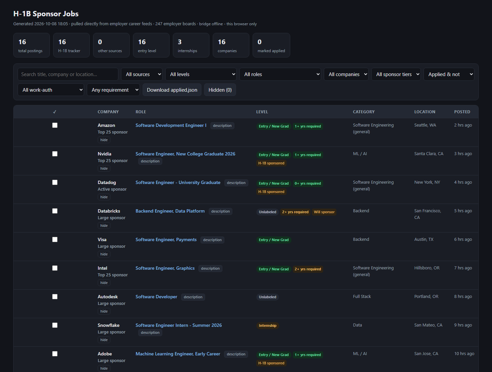

# FAANG + JobRight Jobs Tracker

A personal job-hunting toolkit that pulls fresh software/CS postings from **H‑1B‑sponsoring employers** (FAANG and ~240 others) and your **JobRight** recommendations into one filterable report — with an optional Tampermonkey auto‑apply bridge.

> Plain Python + a self‑contained HTML report. No framework, no database — everything is flat files in the project folder.



<sub>The self‑contained HTML report — search, filter, sort, hide companies, and tick jobs as applied. (Sample data shown.)</sub>

## What it does

- **Pulls jobs straight from employers' own careers backends** — Greenhouse, Lever, Ashby, SmartRecruiters, Workday, plus Amazon / Apple / Microsoft. No LinkedIn / Indeed scraping.
- **Tracks ~440 candidate H‑1B sponsors**, 240+ with a live auto‑pulled feed.
- **Merges JobRight recommendations** into the same report.
- **Enriches each posting** — reads the job body for the real years‑of‑experience and sponsorship language.
- **Self‑contained HTML report** — search, filters, column sort, light/dark, works offline. Hide companies you never want to see.
- **Optional auto‑apply** via a Tampermonkey userscript + a localhost bridge.

## Repository layout

```
faang/        H-1B sponsor tracker — fetch, enrich, render, board map, userscripts
jobright/     JobRight recommendations puller
serve.py      localhost bridge (serves the combined report + the userscript API)
check_feeds.py    feed health check
run_check.bat / serve_only.bat    Windows launchers
```

## Setup

This repo ships **with no secrets and no personal data** — you fill in a few placeholders locally:

| File | Placeholder | What to put |
|---|---|---|
| `jobright/fetch_jobright.py` | `YOUR_JOBRIGHT_SESSION_ID` | your JobRight login cookie |
| `faang/tsenta_autoapply.user.js` | `YOUR_GROQ_API_KEY` / `YOUR_GEMINI_API_KEY` | API keys for the LLM screener |
| `faang/tsenta_autoapply.user.js` | `YOUR_RESUME_SUMMARY_HERE` | a short plain‑text summary of your resume |

Requires **Python 3** with `requests` and `openpyxl`.

## Quick start

```bash
# Windows: fetch everything, health-check, then serve both accounts' report
run_check.bat

# or just serve what's already been fetched (no network)
serve_only.bat
```

Then open **http://127.0.0.1:8765/** for the combined report.

Manual (any OS):

```bash
cd faang
python fetch_jobs.py        # pull new jobs since last run
python enrich.py            # read posting bodies for YOE / sponsorship
cd ../jobright && python fetch_jobright.py
cd ../faang && python report.py
cd .. && python serve.py    # bridge on 127.0.0.1:8765
```

## How it works

`probe_boards.py` discovers which public job‑board API each employer uses and writes `boards.json`; `fetch_jobs.py` then pulls only postings newer than a per‑company watermark, filters to US CS roles, and writes the report. Full pipeline, flags and internals are documented in **[faang/README.md](faang/README.md)**.

## Caveats

- **Personal project** — not affiliated with any employer, JobRight, or Tsenta.
- The sponsor list is a **hand‑built set of candidates**, not USCIS data. Verify any employer at the [USCIS H‑1B Employer Data Hub](https://www.uscis.gov/tools/reports-and-studies/h-1b-employer-data-hub).
- Level and years‑of‑experience are **inferred** — always confirm on the actual posting, and past sponsorship never guarantees it for a specific role.
- The auto‑apply userscript may conflict with a site's terms of service; use at your own discretion.
